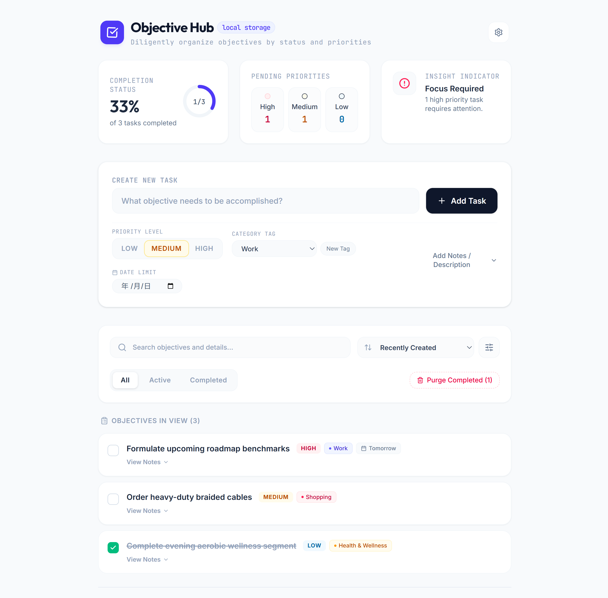
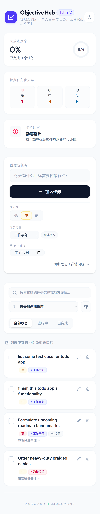
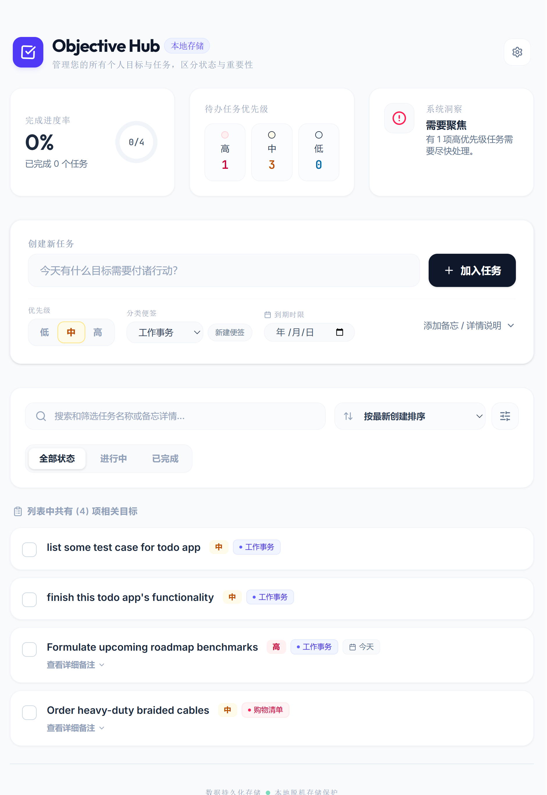

# Objective Hub - Modern Real-time Personal Target Tracker

A sleek, robust, serverless React and TypeScript target & task organization system with offline-first client storage. Craftsmanship and high-performance design come together to deliver an intuitive, responsive personal workspace.

---

## Snapshots







## 🌟 Core Features

- **Multilingual Support (中英文双语)**: Switch instantly between English and Chinese with a fully localized interface. The translation selector is located inside the top-right Configuration Panel.
- **Priority Segment & Segment Filtering**: Distinguish status levels clearly (High, Medium, Low) and isolate specific priorities, categories, or keywords layout-wide.
- **Precision Local Persistence**: High-integrity integration with browser `localStorage`. Includes full configuration backup/export and restore/import features utilizing secure `.json` files.
- **Dynamic Category Generation**: Custom label generator that applies harmonious, distinctive background shades, borders, and visual accent colors.
- **Fully Automated Test Suite**: Solid codebase verified by standard localized unit tests using `vitest` covering utility formats, multilingual values, and core todo logical engines.

---

## 🛠️ Technology Stack

- **Client**: React 18, Vite, Tailwind CSS, `motion/react` (for fluid interaction animations), Lucide React Icons.
- **Task Runner / Build**: Vite.
- **Testing**: `vitest` (rigorous client-side/logical coverage).

---

## 🚀 Running Locally

Ensure Node.js is installed on your local environment.

### 1. Install Dependencies
```bash
npm install
```

### 2. Live Dev Server
Runs a static dev server with hot module replacement support.
```bash
npm run dev
```
Open [http://localhost:3000](http://localhost:3000) in your browser.

### 3. Execution of Automated Tests
Execute our comprehensive logical test cases (27+ assertions):
```bash
npm run test
```

### 4. Build for Production
This compiles the static client assets into the `dist/` directory.
```bash
npm run build
```

---

## ☁️ Deployment to Cloudflare

This application can be deployed instantly to **Cloudflare Pages** as a high-performance static site.

[](https://dash.cloudflare.com/?to=/:account/pages/new)

### 1. Build Settings in Cloudflare Pages

Project setup in the Cloudflare dashboard:
- **Framework Preset**: `Vite`
- **Build Command**: `npm run build`
- **Build Output Directory**: `dist`

---

## 📂 Codebase Anatomy

- `/src/App.tsx` : Core React layout coordinating state flow, filters, and localStorage synchronization.
- `/src/translations.ts` : Localization dictionary and string extraction utilities.
- `/src/components/` : Split, modular UI blocks (`TodoForm`, `TodoFilters`, `TodoStats`, `TodoList`, `TodoItem`).
- `/src/tests/` : Comprehensive business flow and localized string format test assertions.
- `/src/utils.ts` : Data mapping, date localization format operations, and overdue indicators.
